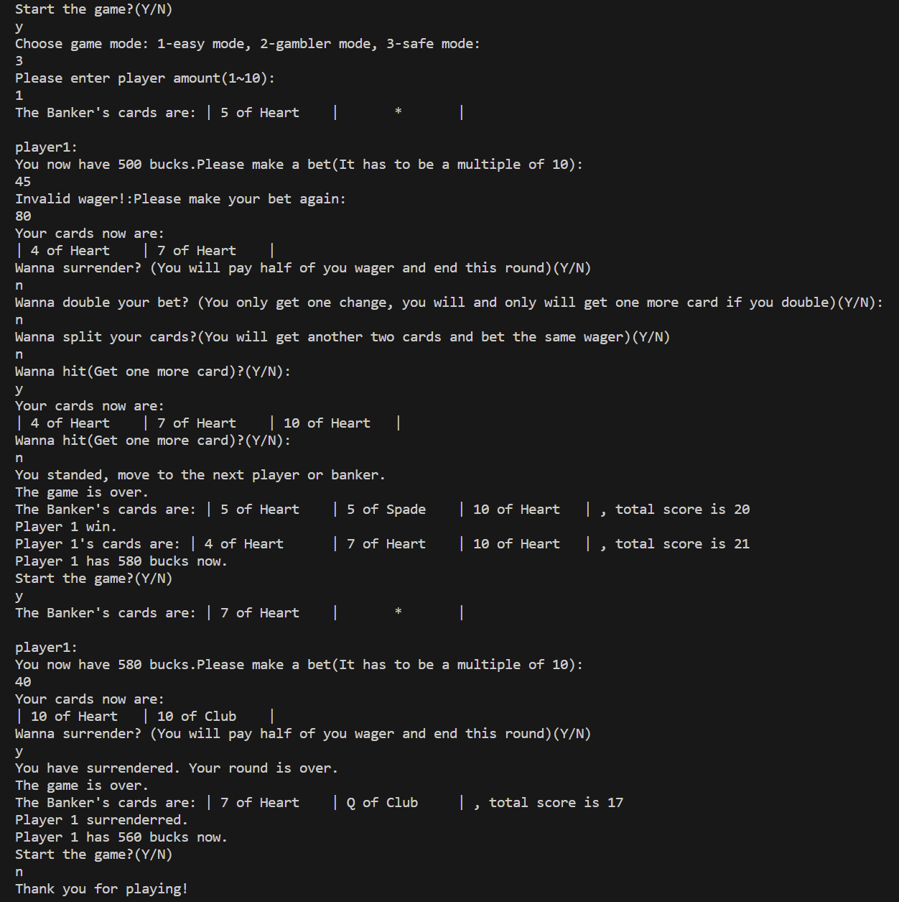

# 		第十小组    Lab3    说明文档 

## 一、分工情况：

​		黄宸一：给出前期的功能框架，修复程序逻辑bug，代码合并前进行代码质量检测工作，完成安全模式、实现投降、保险功能，完善分牌方法

​		顾易浩：初步完成分牌功能，修改与分牌相关的计算点数与结算等方法，完成赌徒模式搭建

​		陈星宇：完成Lab3要求下的游戏初始化并修改用户交互方法，在Dealer类中进行代码解耦合并实现单例模式，设计Player内部类Wallet（原型是顾易浩3.0.5提交的Wallet代码），完成加倍下注的功能，完成说明文档

​		陈一先：代码测试、修改Test类以测试关键的项目方法

## 二、设计思路：

### 1.开发、重构思路：

由于开发内容较多，本文档就重点内容给出说明：

#### (1)多人模式的实现

上一次lab中，我们小组已经基本完成了多人模式的逻辑，本次只需将“playerAmount”修改为由用户输入值决定即可。

#### (2)单例模式的运用

我们本次的实现中使用了单例模式：

~~~java
private volatile static Dealer dealer=null;
private Dealer(Scanner scanner) {
		......
	}

	public static Dealer getDealerInstance(Scanner scanner) {
		if (dealer == null) {  // 如果实例为空
	        synchronized (Dealer.class) { // 同步块，保证只有一个线程可以进入 
	            if (dealer == null) {  // 双重检查，再次确认实例为空
	                dealer = new Dealer(scanner);   // 创建单例实例
	            }  
	        }  
	    }  
		return dealer; // 返回单例实例
	}

~~~

以上代码确保在整个应用程序生命周期内只存在一个Dealer类的实例，做到了lazy初始化以节省资源，同时保证了线程安全。

#### (3)迪米特原则（Law Of Demeter）的运用

本次实验，我们为玩家添加了Wallet类的实例，以方便实现玩家下注等cash mode的新增功能。我们希望Wallet类由玩家持有，其中的方法由且只由玩家进行调用，所以，我们在后期把Wallet设计为Player的内部类，在player中的wallet实例为私有，使之只能与玩家交互，这是对迪米特原则（Law Of Demeter）的运用，降低耦合度，提高系统的灵活性、可维护性和可扩展性。

#### (4)重构Dealer类

3.1.0版本的playerRound方法条件判断嵌套复杂，三种模式的游戏流程混杂进行，晦涩难懂（此时尚未完成完整游戏流程）。代码如下：

~~~java
//Version:3.1.0
private void playerRound(Player player) {
		showPlayerCards();
		if (gameMode != Constants.EASY_MODE) {// 不为简单模式，玩家下注
			player.bet();
		}
		if (gameMode == Constants.SAFE_MODE) {
			player.surrenderChoice();
		} 
		if (player.getGamblingState() == Constants.SURRENDER) {
			System.out.println("You surrendered, move to the next player or banker.");
		} else {
			if (gameMode != Constants.EASY_MODE) {
				player.doubleWagerChoice();
			}
			if (player.getGamblingState() == Constants.DOUBLE) {
				player.getCards(dealersCardCollection.getTopCard());
				if (player.winflag != Constants.LOSE) {
					System.out.println("player" + (playerIndex + 1) + ": ");
					showPlayerCards();
					System.out.println("You doubled your wager and got your card, move to the next player or banker.");
				}
			} else {
				if (gameMode == Constants.SAFE_MODE && bankerWithA()) {
					player.insuranceChoice();
				}
				while (Printer.yesOrNo(scanner, Constants.HIT_OR_NOT)) {
					player.getCards(dealersCardCollection.getTopCard());
					if (player.winflag == Constants.LOSE) {
						break;
					}
					showPlayerCards();
				} 
			}
		}
		showPlayerCards();
		if (player.winflag == Constants.LOSE) {
 
			System.out.println("You lose, move to the next player or banker.");
		} else {
			System.out.println("You standed, move to the next player or banker.");
		}
		allLose &= player.winflag == Constants.LOSE;
		state = (state + 1) % (playerAmount + 3);
		playerIndex++;
	}
~~~

重构以后的代码如下：

~~~java
		if (gameMode == Constants.EASY_MODE) {
			// easy mode game process
		}
		else if (gameMode == Constants.GAMBLER_MODE){
            // gambler mode game process
        }
		else if(gameMode == Constants.SAFE_MODE){
            // safe mode game process
        }
~~~

通过分别处理三种不同的游戏流程，我们减少了代码圈复杂度，避免了重复判断和条件语句深层嵌套的问题。

#### (5)代码分包

随着文件数增加，我们进行了代码的分包，使得代码更易于理解、维护和扩展。

分包前：

分包后：

#### (6)分牌功能的实现

分牌功能是本次lab的难点之一，我们采用的方法是将Attendee中的牌组和记录玩家胜负等情况的相关变量拓展为数组，当玩家选择分牌时，才会有两套牌以及分别对应记录其状态的成员变量。之所以采用数组，是考虑到玩家在未来可能有更多的牌组，采用数组存储多套牌组有利于后期拓展。

~~~java
	//	以下代码来自抽象类Attendee
	protected ArrayList<CardCollection> cardCollections;//牌组ArrayList
	protected int[] totalPoints;//总点数数组
	public int[] winflag;//胜负状态数组，与每套牌一一对应
~~~

#### (7)测试方法

与测试相关的方法被整合到test包中，我们使用了JUnit Jupiter（JUnit 5）和Mockito框架进行单元测试和模拟对象的测试。

# 三、tag截图

中期middle-tag:

# 四、各阶段工作概述

4.18-4.20：添加金钱模式需要的组件和功能，如钱包类、模式选择功能、下注功能等

4.24-4.25：代码重构，以便进行后续开发

4.27-4.30：开发投降、保险功能，同时完善文档

5.3-5.8：完成分牌功能，完善游戏逻辑，代码功能测试

# 五、运行结果截图

1.Easy mode, single player

2.Gambler mode, multiple player , including splitting & doubling (因为split的概率较小，在展示效果时，我们暂时将split的条件调整为花色相同即可分牌) 

3.Safe mode，single player，surrender & handling  invalid input

4.Insurance（We put insurance after splitting）

# 六、实验中遇到的问题及解决方案

1.在项目开发中期，由于lab2对类的构建不够合理，在添加新功能时发现类之间过度依赖，导致修改其中一个类可能会影响到其他类。这大大增加了代码的维护难度，并使得系统更加脆弱，容易出现错误。

解决方案：将类之间的依赖关系通过接口进行定义，而不是直接依赖具体的实现类。遵循面向接口编程的原则，尽量通过接口进行对象的引用和调用，而不是直接引用具体的实现类。

2.本次lab中，随着要实现的功能逐渐复杂，我们小组也暴露出了合作不足的问题，在给出代码框架、明确分工前，对各个功能的实现途径仍然相当模糊，没有经过统一的规划，导致大部分的框架被弃用，且由于类与类间的依赖关系不明确，分工合作大多无法并行，严重影响了开发效率。

解决方案：在下一次lab中，我们小组将尝试使用敏捷开发的模式，将大的要求切分成多个相互联系，但也可独立运行的小项目，并分别完成，在此过程中软件一直处于可使用状态，使开发可以并行操作，提高效率。

# 七、实验心得

通过这次实验，我们进一步学到了如何使用Git进行版本控制，深入理解的软件工程中高质量编码的重要性，此外我们也认识到，对需求的合理拆分和抽象化对于软件开发和团队协作是非常重要的。

