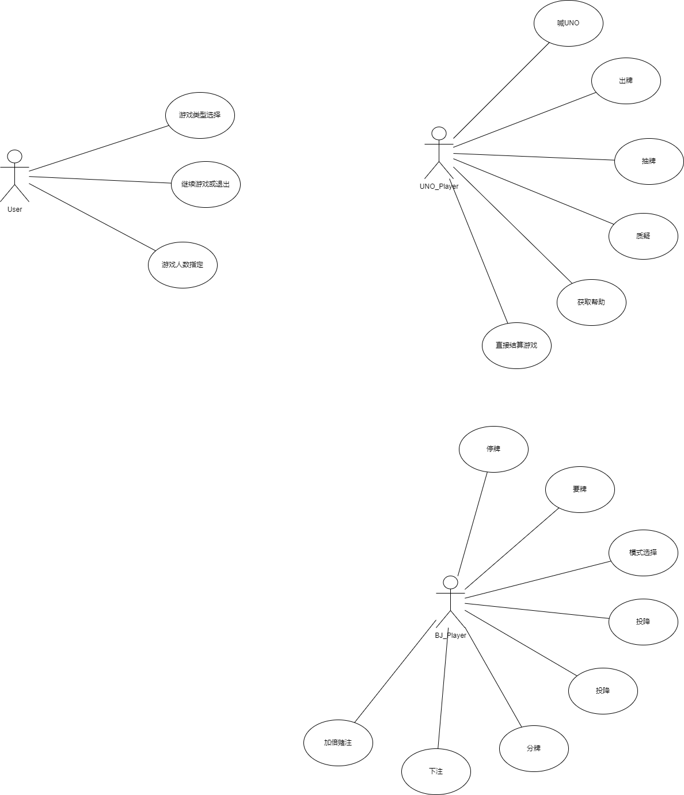
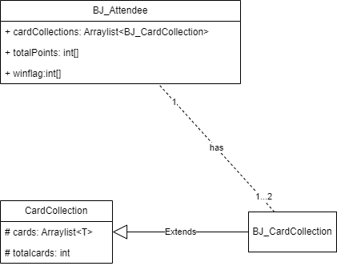
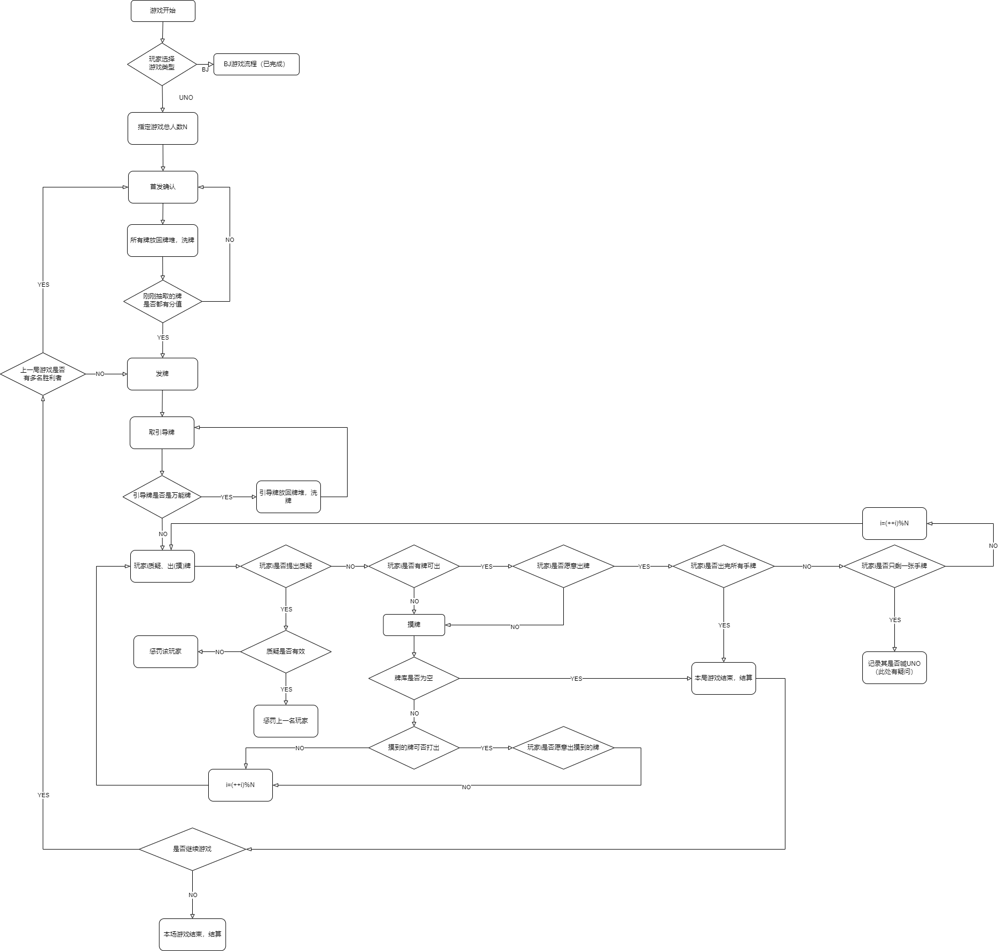

# Lab4 需求分析文档

## 一、lab4 实验要求

https://openmsg.yuque.com/softcourse/zogned/ppqeegyrq6n76v7i

## 二、用例模型和用例分析

### 1.用例模型

用draw.io软件绘制的用例模型详见Readme/lab4/用例模型.io，导出的PNG图片如下：

User表示程序用户，BJ_Player指的是21点游戏(下用BJ代指21点游戏)玩家，UNO_Player则是UNO游戏玩家。

### 2.用例分析

由于BJ的游戏流程在Lab4之前已经完成，故本文档主要进行UNO游戏的需求分析。我们的用例分析如下：

(1) User:

|                |                                             |
| -------------- | ------------------------------------------- |
| **用例**       | 游戏类型选择                                |
| **用户**       | User                                        |
| **简单描述**   | 用户通过与控制台交互选择BJ或UNO作为游戏类型 |
| **基本事件流** | 用户选择游戏类型                            |
| **扩展事件流** | 无                                          |
| **前置条件**   | 程序刚刚初始化完毕                          |
| **后置条件**   | 进入相关游戏流程                            |
| **扩展点**     | 无                                          |

|                |                                               |
| -------------- | --------------------------------------------- |
| **用例**       | 玩家人数指定                                  |
| **用户**       | User                                          |
| **简单描述**   | 用户在通过与控制台交互选择BJ或UNO作为游戏类型 |
| **基本事件流** | 用户输入符合要求的玩家人数                    |
| **扩展事件流** | 无                                            |
| **前置条件**   | 某种游戏（UNO或BJ）刚刚初始化完毕             |
| **后置条件**   | 游戏创建对应数量的玩家                        |
| **扩展点**     | 无                                            |

|                |                            |
| -------------- | -------------------------- |
| **用例**       | 继续游戏或退出             |
| **用户**       | User                       |
| **简单描述**   | 用户可以选择继续游戏或退出 |
| **基本事件流** | 用户输入是否希望继续游戏   |
| **扩展事件流** | 无                         |
| **前置条件**   | 一局游戏刚刚结算           |
| **后置条件**   | 游戏重新初始化或者程序终止 |
| **扩展点**     | 无                         |

(2)UNO_Player:

|                |                                               |
| -------------- | --------------------------------------------- |
| **用例**       | 质疑                                          |
| **用户**       | UNO_Player                                    |
| **简单描述**   | 玩家可以在自己的回合选择质疑上一名玩家未喊UNO |
| **基本事件流** | 1.玩家在指令输入时带上-q表示质疑              |
|                | 2.系统解析指令，判断该质疑的合法性            |
| **扩展事件流** | 2a. 质疑合法                                  |
|                | 2a.1 上一名玩家被罚摸两张牌                   |
|                | 2b. 质疑非法                                  |
|                | 2b.1 此玩家被罚摸两张牌                       |
| **前置条件**   | 当前是该玩家的回合                            |
| **后置条件**   | 无                                            |
| **扩展点**     | 无                                            |

|                |                                                              |
| -------------- | ------------------------------------------------------------ |
| **用例**       | 喊UNO                                                        |
| **用户**       | UNO_Player                                                   |
| **简单描述**   | 玩家可以在自己的回合选择“喊UNO”，以提示其他玩家自己仅有一张牌 |
| **基本事件流** | 1.玩家在指令输入时带上-u表示喊出UNO                          |
|                | 2.系统解析指令，判断该UNO的合法性                            |
| **扩展事件流** | 2a. 玩家UNO不符合游戏规则                                    |
|                | 2a.1 玩家被罚摸两张牌                                        |
| **前置条件**   | 当前是该玩家的回合                                           |
| **后置条件**   | 无                                                           |
| **扩展点**     | 无                                                           |

|                |                                                              |
| -------------- | ------------------------------------------------------------ |
| **用例**       | 获取帮助                                                     |
| **用户**       | UNO_Player                                                   |
| **简单描述**   | 玩家可以在自己的回合选择“喊UNO”，以提示其他玩家自己仅有一张牌 |
| **基本事件流** | 1.玩家在指令输入时带上-h表示需要获取帮助                     |
|                | 2.系统展示所有合法指令                                       |
| **扩展事件流** | 无                                                           |
| **前置条件**   | 当前是该玩家的回合                                           |
| **后置条件**   | 无                                                           |
| **扩展点**     | 玩家回合不会跳过，等待其输入其他合法指令                     |

|                |                                                |
| -------------- | ---------------------------------------------- |
| **用例**       | 直接结算游戏                                   |
| **用户**       | UNO_Player                                     |
| **简单描述**   | 玩家可以在游戏尚未结束时强制终止游戏           |
| **基本事件流** | 1.玩家在指令输入时带上-o表示以当前手牌进入结算 |
|                | 2.游戏结算                                     |
| **扩展事件流** | 无                                             |
| **前置条件**   | 当前是该玩家的回合                             |
| **后置条件**   | 本局游戏结束                                   |
| **扩展点**     | 无                                             |

|                |                                                            |
| -------------- | ---------------------------------------------------------- |
| **用例**       | 出牌                                                       |
| **用户**       | UNO_Player                                                 |
| **简单描述**   | 玩家可以选择打出一张手牌                                   |
| **基本事件流** | 1.玩家在指令输入时用 -p 手牌 表示打出手牌                  |
|                | 2.游戏结算                                                 |
| **扩展事件流** | 1a. 此牌不在玩家手牌中                                     |
|                | 1a.1 同错误输入处理，要求重新输入有效指令                  |
|                | 1b. 此牌在当前阶段不可打出                                 |
|                | 1b.1 同错误输入处理，要求重新输入有效指令                  |
| **前置条件**   | 当前是该玩家的回合，玩家有可以打出的手牌，且玩家选择了出牌 |
| **后置条件**   | 下一张打出的牌需与此牌颜色或点数一致（万能牌除外）         |
| **扩展点**     | 无                                                         |

|                |                                                            |
| -------------- | ---------------------------------------------------------- |
| **用例**       | 出牌                                                       |
| **用户**       | UNO_Player                                                 |
| **简单描述**   | 玩家可以选择打出一张手牌                                   |
| **基本事件流** | 1.玩家在指令输入时用 -p 手牌 表示打出手牌                  |
|                | 2.玩家出完所有牌则结算游戏，否则由下一个玩家输入指令       |
| **扩展事件流** | 1a. 此牌不在玩家手牌中                                     |
|                | 1a.1 同错误输入处理，要求重新输入有效指令                  |
|                | 1b. 此牌在当前阶段不可打出                                 |
|                | 1b.1 同错误输入处理，要求重新输入有效指令                  |
| **前置条件**   | 当前是该玩家的回合，玩家有可以打出的手牌，且玩家选择了出牌 |
| **后置条件**   | 下一张打出的牌需与此牌颜色或点数一致（万能牌除外）         |
| **扩展点**     | 无                                                         |

|                |                                                     |
| -------------- | --------------------------------------------------- |
| **用例**       | 抽牌                                                |
| **用户**       | UNO_Player                                          |
| **简单描述**   | 玩家可以选择抽一张手牌                              |
| **基本事件流** | 玩家在指令输入时用 -d 表示摸牌                      |
| **扩展事件流** | a. 若摸到的牌可以打出，玩家可以进行选择是否打出此牌 |
|                | b. 若牌库在玩家抽一张牌后为空，立即结算游戏         |
| **前置条件**   | 当前是该玩家的回合，玩家不愿意或不能出牌            |
| **后置条件**   | 玩家手牌增加该牌                                    |
| **扩展点**     | 无                                                  |

## 三、领域模型

用draw.io软件绘制的领域模型详见Readme/lab4/领域模型.io，导出的PNG图片如下：

因为BJ和UNO两个游戏的Card相差极大，故我们没有设计Card的抽象类。我们设计了CardCollection的抽象类，从中派生出两个游戏各自的牌组，详见代码设计文档的UML类图。

## 四、交互图

用draw.io软件绘制的交互图见Readme/lab4/交互图.io，导出的PNG图片如下：

