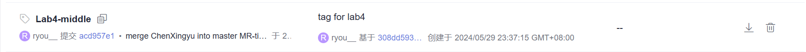
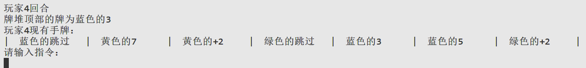
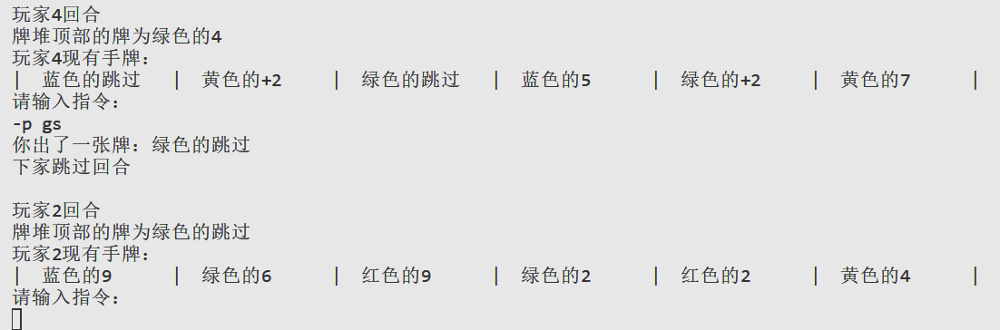
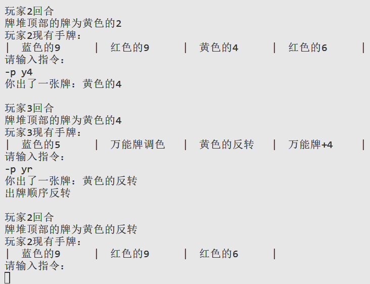
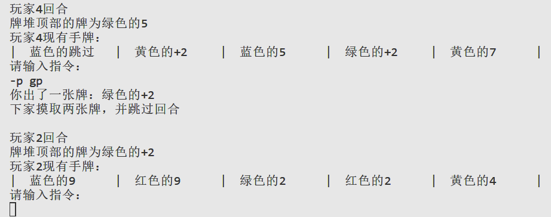
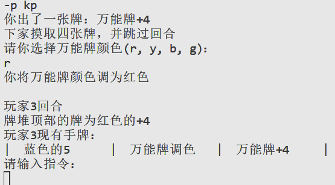
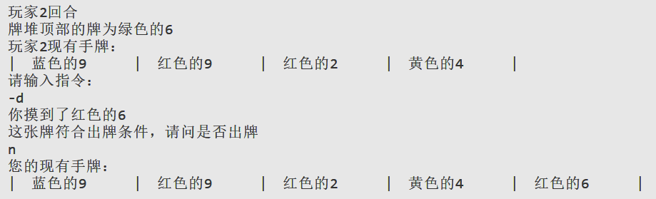
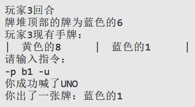
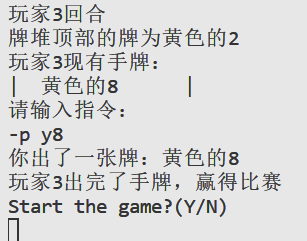
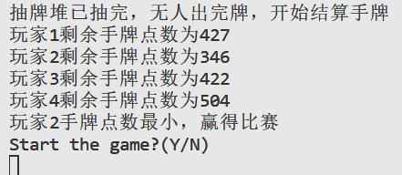

# Lab4 实验报告

## 一、项目计划

本次Lab项目制作时间为5月15日至6月5日。

时间上我们的划分为：
| 时间段      | 任务安排                         |
| ----------- | -------------------------------- |
| 5.15 - 5.22 | 初步设计、进行需求分析并完成访谈 |
| 5.23 - 5.28 | 整体游戏流程与分块架构           |
| 5.29 - 6.3  | 各游戏流程实现与完善             |
| 6.4  - 6.5  | 代码重构与文档撰写               |

类似BlackJack的实现，在UNO游戏中的类安排为：
| 类名               | 主要作用                                             |
| ------------------ | ---------------------------------------------------- |
| UNO_Player         | 玩家类，存储手牌(cards)并记录UNO状态(isUNO)          |
| UNO_Card           | 卡牌类，存储单张牌的颜色、点数、类型                 |
| UNO_CardCollection | 牌组类，CardCollection类的子类，存储对牌组操作的方法 |
| UNO_Controller     | UNO游戏主类，包含整体游戏流程                        |
| UNO_Constants      | 常数类，存储颜色、卡牌类型等变量对应的常数           |

在呈现效果上，我们计划采用软提示 + 命令行的形式进行游戏，即玩家可以输入各种指令做出摸牌、打牌、喊UNO等操作，但系统不会硬提示玩家何时需要喊UNO。

## 二、小组分工

| 人名   | 分工                                                         |
| ------ | ------------------------------------------------------------ |
| 黄宸一 | UNO整体流程架构、方法框架设置、玩家指令处理与提示、首发确认、单局游戏结束结算、实验报告、需求分析文档 |
| 陈星宇 | 代码重构、方法框架设置、游戏初始化、游戏类型选择、开牌、代码设计文档、需求分析文档、UML类图、流程图、领域模型图、交互图、用例模型、用例图 |
| 顾易浩 | 玩家喊UNO操作、质疑前一玩家操作                              |
| 陈一先 | 代码测试、代码测试文档、玩家摸牌操作、出牌操作               |

## 三、中期tag截图

## 四、游戏全流程运行截图或视频demo
- 游戏选择

- 人数确认

- 首发确认
  - 首次首发确认

  - 根据前一局游戏结果进行首发确认

- 开牌

- 整局游戏开始之前进行软提示

- 玩家回合提示

- 打牌
  - 检测是否可出，若该牌不可出则提示重新出牌

  - 功能牌实现

  - 万能牌实现

- 摸牌，抽到可出的牌继续询问是否打出

- 喊UNO，若不符合UNO要求则进行惩罚

- 质疑，若前一位玩家只剩一张牌但没喊UNO则对前一玩家进行惩罚，否则质疑失败，对该玩家进行惩罚

- 当有人出完牌或牌组被抽完，游戏结束，进行结算
  

## 五、实验中遇到的问题及解决方案
- 根据华为云的代码评估，本次项目中遇到多次“代码认知复杂度过高”的问题
  - 根据代码评估找到问题并进行代码重构，尽量减少代码认知复杂度与圈复杂度，详见代码设计文档中的代码重构说明
- 在实验过程中主要遇到的问题在于四个人之间的沟通与信息同步
  - 本次实验吸取了前次的经验，使用敏捷开发的模式，将大的要求切分成多个相互联系，也可独立运行的小项目，并分别完成，已经解决了前次lab中的框架弃用问题。但并行设计开发仍效率不高，并且由于部分重构次数过高，合并时查错花费的时间较多。
  - 需要继续规范化开发流程，将合并工作分到本地并合理化重构流程，避免单人合并压力过高。
### 仍未解决的问题
- UNO_Card类可能也能更改为与BJ_Card同属父类Card，若以后有更多卡牌游戏需实现，使用Card抽象类会有更高的可拓展性，但本次实验中并未这样设置。
## 六、实验心得
通过这次实验，我们进一步学到了如何进行需求分析与合理的拆分与抽象化，深入理解的软件工程中高质量编码的重要性，但我们仍需要在未来的实践中进一步规范流程、优化策略，真正提高开发效率与代码质量。